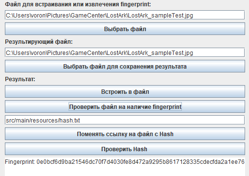
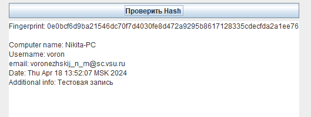

# Контроль распространения информации с использованием технологии fingerprinting

## Описание проекта
Этот проект разработан для обеспечения контроля распространения информации с использованием технологии fingerprinting. 
Fingerprinting — это метод идентификации данных, который создает уникальный "отпечаток" для 
определения или проверки их идентичности. Встраивание цифрового отпечатка устройства
происходит в метаданные файла. Это позволяет выполнить встраивание в файл любого
расширения. Сам fingerprint является хэш-токеном, сгенерированным по алгоритму
SHA-256. Этот алгоритм позволяет сделать длину отпечатка фиксированной.
Результаты работы программы сохраняются в файл на вашем устройстве. В нем результаты
представлены в виде: "Original message : Hash".

## Основные функции
 - Создание уникальных отпечатков для встраивания в файлы.
 - Проверка на наличие fingerprint в файлах.
 - Оценка и контроль распространения информации на основе сравнения отпечатков.
 - Возможность дальнейшей модернизации для интеграции с другими системами и автоматизации процессов контроля.

## Описание программы

#### При запуске программы пользователь попадает на главное окно приложения.

Пользователь может, по желанию, внести корректировки в автоматически заполненные 
поля. Стандартные и технические значения полей «Электронная почта» и 
«Дополнительная информация» в случае генерации fingerprint не передаются.

#### Выбор файла для встраивания или извлечения fingerprint. 
Для этого нужно нажать на одноименную кнопку «Выбрать файл». 
По нажатии открывается диалоговое окно выбора файла.

Выбранный файл загружается в программу, заполняются поля «Файл для встраивания 
или извлечения fingerprint» и «Результирующий файл». 
В поле «результирующий файл» можно ввести другой путь 
(нажатием на кнопку «Выбрать файл для сохранения результата») или поменять название файла, тем самым результат будет сохранен по новому пути.

#### Встраивание в файл
При нажатии на кнопку «Встроить в файл» будет выполнено встраивание fingerprint 
в метаданные выбранного файла, если файла не существует или путь не выбран, 
то произойдет ошибка.

#### Проверка файла

При нажатии на кнопку «Проверить файл на наличие fingerprint», необходимо, 
чтобы поле «Файл для встраивания или извлечения fingerprint» не было пустым, 
тем самым данный файл будет проверен на наличие встроенной в него дополнительной 
информации.

#### Смена ссылки на файл с хэш

Для этого необходимо нажать на одноименную кнопку, далее выбрать файл.

#### Проверка hash'а
Кнопка «Проверить Hash» проверяет файл с результатами встраивания на наличия 
совпадения хэш-токенов. Если токен найден, то в поле ниже появится 
детальная информация о данных устройства.

## Инструкция по использованию

1. Заполнить информационные поля для встраивания информации.
   
   
2. После нажатия на кнопку «Встроить в файл» выводится информационное сообщение о результатах встраивания.
3. Для проверки, необходимо, чтобы соответствующее поле в окне программы хранило в себе ссылку на файл с отпечатком.
   
   
4. Если отпечаток обнаружен, то можно выполнить проверку на совпадение в файле с хэшами, нажав на одноименную кнопку.
   
   

## License
This project is licensed under the [MIT License](https://opensource.org/license/MIT). Feel free to modify and distribute it for your own purposes.